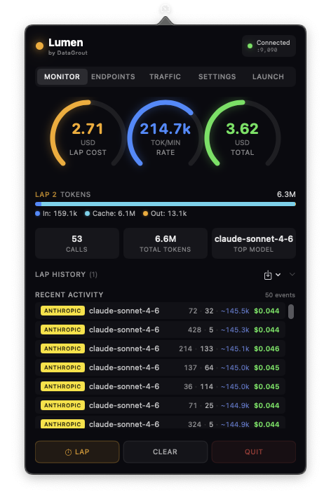

# Lumen

[](https://github.com/datagrout/lumen/actions/workflows/ci.yml)

**Real-time LLM usage monitor and cost tracker** -- a native macOS status bar app by [DataGrout](https://datagrout.ai).

<p align="center"></p>

Lumen intercepts LLM API traffic, extracts token usage and cost metadata, and displays it in a live gauge interface from your menu bar. Think of it like Activity Monitor for your AI spending.

## Architecture

Two processes, zero npm dependencies:

```
┌─────────────┐     ┌────────────────────────────────┐     ┌─────────────┐
│  LLM Client │────▶│  lumen-core (Rust)             │────▶│  LLM API    │
│  (Cursor)   │◀────│  HTTP proxy :9090              │◀────│  (OpenAI)   │
└─────────────┘     │  JSON API   :9091              │     └─────────────┘
                    │  parser · pricing · aggregator │
                    └──────────────┬─────────────────┘
                                   │ GET /stats
                    ┌──────────────▼────────────────┐
                    │  Lumen.app (Swift)            │
                    │  NSStatusItem + SwiftUI       │
                    │  gauges · events · settings   │
                    └───────────────────────────────┘
```

- **lumen-core** -- Rust binary. Runs an HTTP forward proxy on `:9090` that intercepts LLM API calls, parses token usage from responses, calculates costs, and aggregates stats. Exposes a JSON API on `:9091` for the UI.
- **Lumen.app** -- Native macOS status bar app. SwiftUI popover with arc gauges, event feed, endpoint manager, and DataGrout integration toggles. Launches and manages `lumen-core` as a child process.

## Features

- **Live gauges** -- Cost, token rate, and cache savings displayed as real-time arc meters
- **Multi-provider** -- OpenAI, Anthropic, Cursor, and Google AI supported out of the box
- **Token breakdown** -- Input vs output with cache hit visualization
- **Event feed** -- Scrollable log of every API call with model, tokens, and cost
- **Lap tracking** -- Lap button marks a session boundary for before/after cost comparisons
- **Endpoint monitoring** -- See exactly which URLs are intercepted and what data is captured
- **Custom endpoints** -- Whitelist additional hosts (local LLMs, hosted models, MCP servers)
- **DataGrout integration** -- Toggle DG tools visibility and Intelligent Interface
- **Privacy-first** -- In normal operation, only token counts and pricing metadata are captured; message content is never stored or transmitted. An opt-in debug capture mode (`POST /api/debug/arm`) can temporarily buffer raw request/response payloads in memory for diagnostics — it is off by default and payloads are cleared on disarm.

## Prerequisites

- macOS 14.0+
- [Rust](https://rustup.rs/) (1.70+)
- Xcode Command Line Tools (`xcode-select --install`)

## Installation

```bash
sh install.sh
```

This builds both binaries in release mode, assembles a `Lumen.app` bundle in `~/Applications`, and runs `mdimport` so Spotlight picks it up immediately. After that, **Cmd+Space -> "Lumen"** launches the app.

To run in development without installing:

```bash
sh run.sh   # debug build, live logs in the terminal
```

## Setup

### 1. Trust the Lumen CA certificate

Lumen performs TLS interception to read encrypted HTTPS traffic. This requires trusting a locally-generated CA certificate once.

The setup wizard (launched on first run) walks through this automatically. To do it manually:

```bash
# The CA cert is generated at first launch and lives at:
~/.lumen/ca.pem

# Trust it system-wide (prompts for your password):
sudo security add-trusted-cert -d -r trustRoot -k /Library/Keychains/System.keychain ~/.lumen/ca.pem
```

You can also do this from **Settings -> Certificate -> Trust CA** inside the Lumen UI.

### 2. Configure your LLM client

**Cursor** (recommended — use the launcher shortcut):

The easiest way is the **Launch** tab in Lumen, which starts Cursor with the proxy and CA cert pre-configured:

```
Lumen -> Launch -> Cursor -> Launch
```

This sets `HTTPS_PROXY=http://127.0.0.1:9090` and `NODE_EXTRA_CA_CERTS=~/.lumen/ca.pem` automatically.

To configure manually instead:
1. Trust the Lumen CA (step 1 above)
2. Cursor Settings -> Network -> **HTTP Compatibility -> HTTP/1.1** (required for gRPC capture)
3. Set system proxy to `127.0.0.1:9090` or `export HTTPS_PROXY=http://127.0.0.1:9090`

**Claude Desktop / other tools:**

```
Lumen -> Launch -> [select tool] -> Launch
```

Or manually: `HTTPS_PROXY=http://127.0.0.1:9090 open -a "Claude"`

**CLI / scripts:**

```bash
export HTTPS_PROXY=http://127.0.0.1:9090
export NODE_EXTRA_CA_CERTS=~/.lumen/ca.pem  # Node.js
export SSL_CERT_FILE=~/.lumen/ca.pem         # Python / curl
```

### 3. Watch the gauges

Click the Lumen menu bar icon. Cost, token rate, and cache savings update in real time as you use your LLM tools.

## Custom Endpoints

Lumen ships with built-in support for `api.openai.com`, `api.anthropic.com`, `*.cursor.sh`, `generativelanguage.googleapis.com`, and `claude.ai`. To monitor additional hosts (self-hosted models, OpenAI-compatible APIs, MCP servers):

1. Open **Lumen -> Endpoints**
2. Click **+** and enter the hostname (e.g. `my-llm.internal` or `api.together.xyz`)
3. Lumen will proxy and parse traffic to that host on the next request

Custom hosts are stored in the daemon config and persist across restarts. Any host that returns OpenAI-compatible or Anthropic-compatible JSON or SSE will have its token usage extracted automatically; others will use byte-based estimation.

## Relay Routes

For tools that don't support proxies, Lumen can act as a relay endpoint — requests to `http://127.0.0.1:9090/anthropic` are forwarded to `https://api.anthropic.com`, adding monitoring transparently.

Built-in relay routes: `/openai`, `/anthropic`, `/google`

## DataGrout Integration

Connect Lumen to a DataGrout server to sync usage events and lap snapshots for team reporting:

1. **Settings -> DataGrout -> Connect** — paste your DataGrout server URL (or bare UUID)
2. Complete the OAuth flow in the browser
3. Usage events sync every 30 seconds; lap snapshots sync immediately when you press the lap button

## Project Structure

```
lumen/
  lumen-core/             # Rust daemon
    src/
      main.rs             # entry point -- starts proxy + API server
      api.rs              # JSON API on :9091
      proxy/mod.rs        # HTTP forward proxy on :9090
      parser/mod.rs       # LLM response parser (OpenAI, Anthropic, Cursor, Google)
      pricing/mod.rs      # token pricing database with fuzzy matching
      aggregator/mod.rs   # real-time stats aggregation + lap tracking
      state.rs            # shared app state
      sync.rs             # DataGrout usage sync
  Lumen/                  # Swift macOS app
    Sources/
      LumenApp.swift      # NSStatusItem + NSPopover setup
      PopoverView.swift   # main SwiftUI view
      GaugeView.swift     # arc gauge component
      EventFeed.swift     # recent events list
      HostsView.swift     # monitored endpoints panel
      SettingsView.swift  # DG toggles, proxy config
      APIClient.swift     # polls lumen-core JSON API
      DaemonManager.swift # manages lumen-core process lifecycle
      WizardView.swift    # first-run setup wizard
```

## License

[MIT](LICENSE)

Copyright 2026 [DataGrout AI](https://datagrout.ai)
